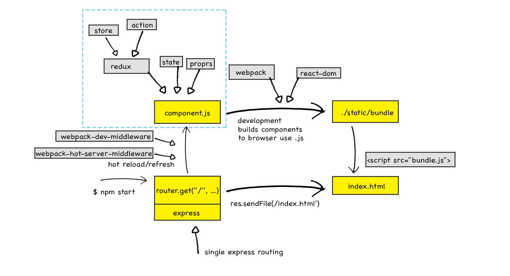

# Razzle and Redux Example

## Server Side Rendering Structure


### Server Side
source code: [src/server/index.js](./src/server/index.js)

1. Fetch the initial state from backend API, here is [src/common/api/counter.js](./src/common/api/counter.js)
2. Create `redux store` with that initial state
3. Use `renderToString()` from `react-dom/server` to render component (wrapped inside redux store/Provider) into string
4. create **stringified html**, inside that: 
    1. put stringified react component from step 3 inisde DOM.
    2. serialize the state of store and set as a global varaible `window.__PRELOADED_STATE__`
    3. put **client side js bundle (assests)** into `script` so that can load in client side.
5. retur the html to client

### Client Side
source code: [src/client/index.js](./src/client/index.js)

1. get the html
    - At this point: html is **contentful** with initial state with also pure static information.
    - SEO friendly achieved.
2. download js bundle
3. hydrate the app with `window.__PRELOADED_STATE__`
    - At this point: the page is interactable 

---

## Razzle Webpack Build
source code: [./node_modules/razzle/scripts/build.js](./node_modules/razzle/scripts/build.js)


---
## How to use

<!-- START install generated instructions please keep comment here to allow auto update -->
<!-- DON'T EDIT THIS SECTION, INSTEAD RE-RUN yarn update-examples TO UPDATE -->Create and start the example:

```bash
npx create-razzle-app --example with-redux with-redux

cd with-redux
yarn start
```
<!-- END install generated instructions please keep comment here to allow auto update -->

## Idea behind the example
Almost 100% of the code is taken from the [official Redux universal example](https://github.com/reactjs/redux/tree/master/examples/universal).
